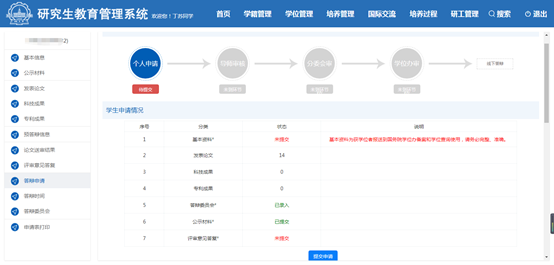

==================================
5. 正式答辩
==================================

在收到论文的评阅意见后，需要根据评阅意见仔细修改论文，逐条回复评阅人提出的论文不足及修改意见。如果专家认为创新点不成立，则需要重点答复。需要注意的是，后续要在系统中提交对评阅意见的回复，因此回复仅由文字构成，不能含有任何公式和图表，文字不超过5000字。

导师对论文修改满意后，即可准备正式答辩。在申请前，先和导师确定答辩时间地点和答辩委员会成员。一般规定答辩时间应提前一周申请。答辩委员会应至少有7位评委，导师和副导师仅能有一人出席。如果进行线上答辩，应有不少于2名来自外校的评委出席。

----------------------------------
在线申请
----------------------------------

博士答辩申请的整体流程为：论文送审结果返回--答辩秘书汇总评阅意见--学生提交答辩申请--导师审查--分委会审查--学位办审查--线下答辩。

在系统中填写信息时可以随时点击保存，但不要提交。一旦提交材料，则无法再更改。

在研究生院网站上登陆研究生管理系统，在 ``学位管理`` 选项卡中选择 ``博士答辩申请``，在页面中填入：

* 基本信息。包括一级学科、答辩日期、论文题目、论文关键词（3-5个，用英文逗号隔开）、研究方向、论文字数、论文类型、选题来源、前置学位信息和毕业后去向等。论文类型和选题来源不清楚的可以和导师沟通确定。学位信息中需要提交学位照片，需要注意此照片应与提交在学信网、学位证和毕业证等照片保持一致。
* 答辩时间地点和答辩委员会成员。在录入答辩委员会时校内老师可直接在系统中选择，注意核对校外老师的职称等信息，和导师确认委员会成员的打印顺序。一般要将主席排在第一位，秘书排在最后一位。
* 评审意见答复。首先将论文评阅意见发送给答辩秘书，请答辩秘书在他自己的系统中为你录入专家评审意见。然后你自己在学生意见答复中录入对论文中所存在的问题和不足的答复意见。

最后检查公示材料和发表论文信息是否需要更新，点击提交申请按钮将答辩申请提交至导师。

联系导师为你通过导师审查。导师要在系统中填写论文的评语，必要的话可提前准备好评语草稿供导师修改。

----------------------------------
领取材料
----------------------------------

在导师通过线上审批后，即可联系教学秘书提交纸质申请并领取相关材料。提前准备好：

.. admonition:: 引用：`申请博士学位流程说明 <http://hitgs.hit.edu.cn/2014/0916/c3333a92586/page.htm>`_

    * （1）有博士生本人签字的答辩申请书（2份）；
    * （3）有导师签字的答辩资格审查表（2份）；
    * （4）答辩委员会成员审批表（2份）；
    * （5）有导师、院（系）主管领导签字确认的发表学术论文清单（2份）；
    * （6）有导师签字的评审意见汇总材料（1份）；
    * （7）博士学位情况表（1份）；

教学秘书会为以上材料签章。如果是线上答辩，还需提交有导师签字的线上答辩申请书，在线上预答辩申请书模板上稍做修改即可。

教学秘书还会为你提供博士成绩单3份、博士学位档案封皮2张和答辩表决票若干。其中博士成绩单需要粘贴一寸照片，并前往师生服务大厅研究生院窗口盖章。3份成绩单有2份需要在未来放入学位档案，另一份自留。如果你参加了学校的集中照片采集，还可向教学秘书直接领取照片来粘贴。表决票用于答辩现场老师表决，未来需要放入学位档案，因此请 **务必** 妥善保存。

在师生服务大厅，除了要办理成绩单盖章外，还要在研究生自助打印机上打印有盖章的论文评阅意见。使用研究生系统的账号密码登陆即可。注意原版评阅意见仅此一份，未来需要放入学位档案，因此请 **务必** 妥善保存。

----------------------------------
答辩准备
----------------------------------

答辩会场的布置参照预答辩。

在正式答辩中，需要答辩秘书对答辩人和答辩委员会做简要介绍，可参考我的PPT模板进行制作：《`答辩委员会简介、评审意见及回复 <_static/答辩委员会简介、评审意见及回复.pptx>`_》，使用前需自行安装字体 **华康俪黑金** 和 **方正北魏楷书简体**。根据答辩条例，包含了答辩人简况（学习成绩、简历、学位论文工作情况及学术论文发表情况）、答辩委员会组成名单、论文评阅意见及回复、答辩决议草案等内容的模板。

将准备好的介绍PPT、答辩决议草案、答辩表决票提前发给答辩秘书。

----------------------------------
正式答辩
----------------------------------

正式答辩流程可参考《`博士研究生学位论文答辩及学位审查工作细则 <http://hitgs.hit.edu.cn/2014/1027/c3425a109311/page.htm>`_》

答辩人需要进行40-50分钟的论文介绍，推荐以45分钟为宜。

然后评委老师们检查外审及答复情况，进行问答，提出论文的修改意见。可以请同学帮忙进行记录或录音，便于日后修改。

如果进行线上答辩，则参考《`哈尔滨工业大学新冠肺炎疫情防控期间博士研究生在线学位论文答辩实施细则（试行） <http://hitgs.hit.edu.cn/2020/0309/c3330a236640/page.htm>`_》中的流程，需要答辩秘书对答辩全程录屏录音并准备在线无记名投票。

----------------------------------
正式答辩后
----------------------------------

答辩完成后，需要答辩秘书在自己的系统中录入答辩现场问答情况和答辩决议。你可根据答辩现场草拟好相关内容供答辩秘书参考。

在完成录入后，需要在系统中下载《博士答辩情况表》双面打印2份，请答辩委员会主席和答辩秘书分别在相应位置签字。此文件需要在未来放入学位档案。
