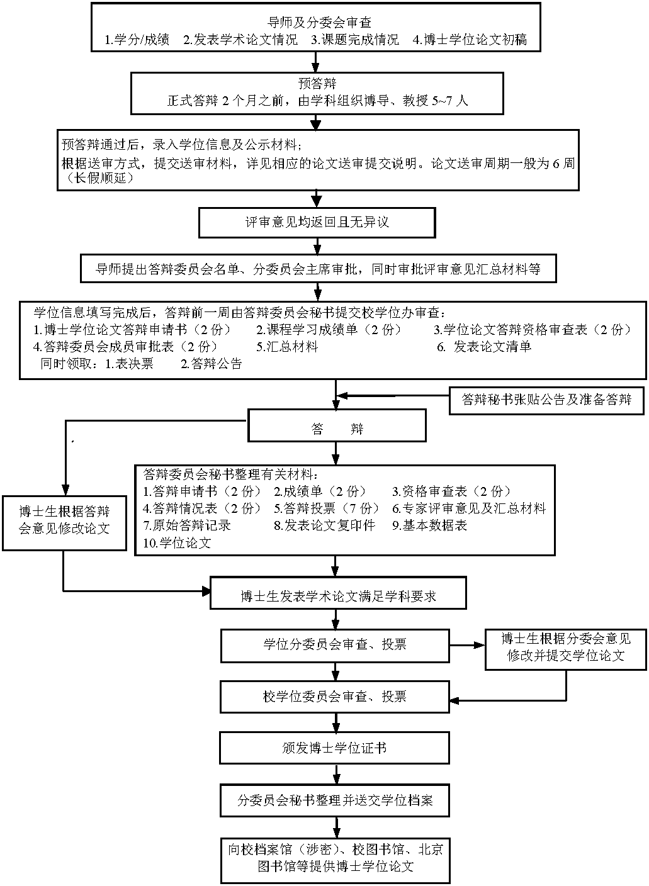

==================================
0. 引言
==================================

----------------------------------
写在前面
----------------------------------

欢迎你，我的朋友！我将向你介绍哈工大博士学位申请的流程，提前熟悉所有环节吧！

哈工大申请博士学位一般流程为：

博士论文撰写——校内预审（1周）——预答辩（正式答辩前2个月）——外审（6周）——正式答辩——向院学位办提交材料——学科学位分委员会（校会前1或2周）——校学位委员会——颁发学位证。

申请博士学位流程图如下：

我建议你在期望的校学位会时间提前至少 **半年** 开始准备博士论文及答辩工作。

.. admonition:: 引用：`申请博士学位流程说明 <http://hitgs.hit.edu.cn/2014/0916/c3333a92586/page.htm>`_

    校学位会每年4次，一般为1月、7月第二周周四及4月、10月第四周周四

**注意！** 2022年6月30日，校学位2022年第27号文件：`关于校学位评定委员会会议召开时间变更的通知 <http://hitgs.hit.edu.cn/2022/0630/c3333a278497/page.htm>`_ 中调整了校会的召开时间，变更为 **3月中下旬、6月中旬、9月下旬、12月下旬**。

在申请博士学位的任何环节都要仔细阅读《研究生手册》学位申请相关部分，并和学院的教学秘书保持密切联系。如果遇到节假日及寒暑假，要提前关注办理手续相关部门的办公值班时间。《研究生手册》和相关的条例规定可以在研究生院网站上查阅。

注意关注研究生网站上毕业生照片采集的相关新闻，这照片会用在学信网、毕业证和学位证等学位信息上。

**艰难困苦，玉汝于成。这将会是黎明前最后的黑暗，勇敢地前进吧！胜利的曙光就在前方！**

----------------------------------
免责声明
----------------------------------

本说明是本人经历的总结，不具有全面性和权威性。所有文档依据来自于公开的网站链接和书面文档，一切解释权归哈工大研究生院所有。

本说明无法保证信息的时效性，极有可能与实际情况存在出入。

如果你想参与本说明的维护，欢迎点击页面右上角的“查看页面源码”与我联系。
