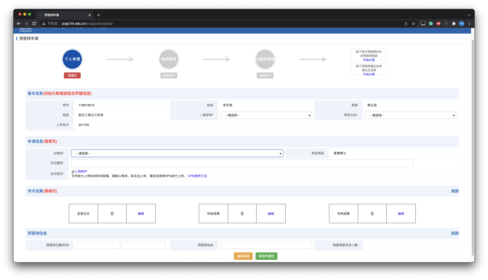
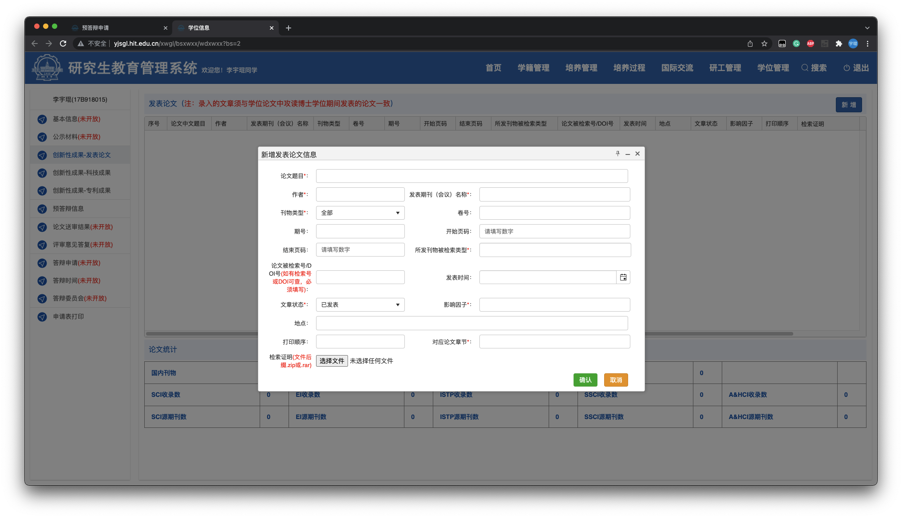

==================================
3. 预答辩
==================================

在完成了学位论文初稿后，经导师审阅认可，就可以联系教学秘书（李景彤，主楼243）申请预答辩权力下放，进入研究生教育综合管理系统录入学位信息、维护本人的学籍信息，填写并下载《博士学位论文预答辩情况表》。

----------------------------------
预审
----------------------------------

根据哈工大力学学科的要求，在进行预答辩之前需要进行校内预审。一般由导师为你联系学科分委会主席（孙毅），他在确认你满足毕业要求后，会为你指派一位老师给你的博士论文预审。

你需要将博士论文和《`预答辩审查表 <_static/预答辩审查表.doc>`_》交给预审老师。预审老师一般会用一周左右的时间完成预审工作，你需要根据《预答辩审查表》内的修改意见对博士论文进行修改，并填写《`博士研究生反馈意见书 <_static/预答辩审查表.doc>`_》。

《预答辩审查表》（文件中的标题为《力学学科博士学位论文专家评阅意见书》）和《博士研究生反馈意见书》是力学学科特有的，无法在研究生院网站上下载到。可以联系教学秘书索取，或者直接点击前面的链接下载。

《博士研究生反馈意见书》需要导师签字。完成后将《预答辩审查表》和《博士研究生反馈意见书》交给教学秘书，她会为你下放申请预答辩权力。

----------------------------------
预答辩申请
----------------------------------

获得了申请预答辩权力且预审结束后，确定好预答辩委员会成员（原则上预审老师须参加预答辩）和时间、地点，就可以在网上申请预答辩了。

根据《`哈尔滨工业大学新冠肺炎疫情防控期间博士研究生在线学位论文答辩实施细则（试行） <http://hitgs.hit.edu.cn/2020/0309/c3330a236640/page.htm>`_》中的规定，新冠疫情期间可以进行线上视频预答辩。这需要向教学秘书另外提交一份线上视频答辩申请书，申请书没有固定的格式，写明具体原因和情况即可。这里是我本人制作并使用的模板：《`线上视频预答辩申请书 <_static/线上视频预答辩申请书.docx>`_》。

预答辩整体流程为：学生提交申请--导师审核--分委会审核。

在研究生院网站上登陆研究生管理系统，在 ``学位管理`` 选项卡中选择 ``预答辩申请``，在页面中填入基本信息（包括一级学科和学科方向）以及申请信息（分委会、论文题目和论文原文）等如下：

逐项点击学术成果中的各项，填入取得的论文信息等如下：

最后在预答辩信息中填入预答辩的时间和地点，并点击预答辩委员会人数，在新打开的页面中录入每位参加预答辩的老师信息，最后点击保存并提交，这就完成了个人申请部分。

接下来联系导师通过导师审核，然后联系教学秘书通过分委会审核。最后将系统生成的《博士学位论文预答辩情况表》保存并打印出来。

----------------------------------
预答辩准备
----------------------------------

如果是线上答辩，建议提前预约好在线会议室并调试好网络和播放设备，提前将在线会议室和论文发给答辩评委。

如果是线下答辩，建议提前一天布置好答辩会场，提前准备好：

* 介绍论文用电脑及投影仪（提前调试好）
* 打印的博士论文（确保评委老师人手一份，无需胶装）
* 纸和笔（评委老师记录问题用）
* 瓶装饮用水
* 时令水果及餐盘（便于食用为宜，答辩当天提前洗好装盘）
* 餐巾纸及湿巾

建议提前一天发短信或微信提醒参与预答辩的评委老师预答辩的时间和地点，避免老师因事务繁忙忘记出席。

----------------------------------
预答辩
----------------------------------

首先进行40-60分钟的论文介绍，推荐以50分钟为宜。

然后进行评委老师们的问答，提出论文的具体修改意见。可以请同学帮忙进行记录或录音，便于日后修改。

----------------------------------
预答辩后
----------------------------------

根据预答辩委员会的意见，将评议意见填入预答辩情况表（不需要对意见进行回复），并请预答辩主席和导师分别在相应位置签字。

根据评议意见继续对论文进行修改。

----------------------------------
参考资料
----------------------------------

* `博士研究生学位论文答辩及学位审查工作细则 <http://hitgs.hit.edu.cn/2014/1027/c3425a109311/page.htm>`_
* `申请博士学位流程说明 <http://hitgs.hit.edu.cn/2014/0916/c3333a92586/page.htm>`_
* `哈尔滨工业大学新冠肺炎疫情防控期间博士研究生在线学位论文答辩实施细则（试行） <http://hitgs.hit.edu.cn/2020/0309/c3330a236640/page.htm>`_
